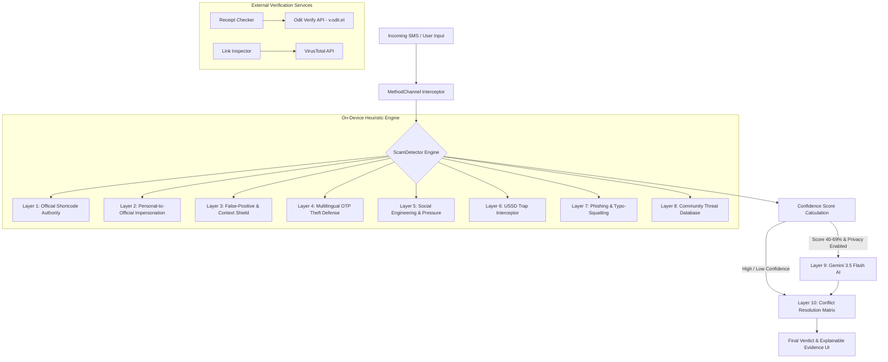

<div align="center">

# 🛡️ Meketa (መከታ) — Scam Shield

### _Offline-First SMS Scam Detection & Live Bank Receipt Verification for Ethiopia_

[](https://flutter.dev)
[](https://dart.dev)
[](#)
[](https://deepmind.google/technologies/gemini/)
[](#)
[](LICENSE)

  <p align="center">
    <b>Meketa (መከታ)</b> is an intelligent, privacy-preserving mobile security solution engineered to protect Ethiopian mobile banking users (Telebirr, CBE, Bank of Abyssinia, Awash, Zemen) against SMS scams, fake credit alerts, OTP theft, and forged transaction receipts.
  </p>

---

[Key Features](#-key-features) •
[Architecture](#-system-architecture) •
[10-Layer Engine](#-10-layer-heuristic-engine) •
[Getting Started](#-getting-started) •
[API Setup](#-configuration--api-keys) •
[Graduation Project](#-insa-graduation-defense)

</div>

---

<div align="center">
  <h3>📱 App UI Designs (Figma Mockups)</h3>

|                                 Home Dashboard                                 |                            Scam Alert Breakdown                            |                              Threat History                              |
| :----------------------------------------------------------------------------: | :------------------------------------------------------------------------: | :----------------------------------------------------------------------: |
|  |  |  |

</div>

---

## 🌟 Key Features

### 🛡️ 10-Layer On-Device Scam Detection Engine

- **Near-Instant Analysis:** Analyzes incoming SMS messages directly on the device using a weighted 10-layer heuristic pipeline.
- **Multilingual Support:** Fully understands fraud patterns in **Amharic**, **Afaan Oromoo**, and **English**.
- **False-Positive Shield:** Distinguishes legitimate peer-to-peer money transfers, account sharing, and standard bank notices from malicious impersonators.
- **Explainable AI Breakdown:** Provides explicit evidence signals showing _why_ a message was flagged (e.g., Header Spoofing, USSD Trap, Urgency Cue).

### 🧾 Live Bank Receipt Verifier (v.odit.et Integration)

- **Real-Time Source Verification:** Directly queries official upstream bank gateways (**Telebirr**, **CBE**, **Bank of Abyssinia**, **AwashPay**, **Zemen Bank**).
- **Metadata Extraction:** Displays settled amounts, service charges, VAT, payer name/account, receiver name/account, branch details, and payment channels.
- **Duplicate Receipt Scanner:** Warns merchants if a customer presents a previously scanned genuine receipt to prevent double-spending fraud.

### 🤖 Multilingual AI Security Assistant (Gemini 3.5 Flash)

- **Second-Opinion Context:** Evaluates ambiguous SMS messages (40%–69% confidence) with deep semantic context.
- **Interactive Security Chat:** Answers user questions in Amharic & English, recommending immediate USSD check shortcodes (`*127#`, `*889#`) and official hotlines (`994`, `951`).
- **Privacy-First Toggle:** Users can disable cloud AI processing at any time, forcing 100% offline analysis.

### 🔍 VirusTotal Link Inspector

- **Malware & Phishing Check:** Scans web links, Telegram links, and bank portals against VirusTotal APIs and local typo-squatting rules (e.g., detecting fake `.xyz` or `.top` domains).

### 👨‍👩‍👧‍👦 Family Protection Shield

- **Community Threat Intelligence:** Maintains local SQLite threat databases (`sqflite`) and incorporates user feedback (marking messages safe/scam) to dynamically tune local detection weights.

---

## 🏗️ System Architecture



---

## ⚙️ 10-Layer Heuristic Engine

| Layer   | Module                | Description                                                                                      |
| :------ | :-------------------- | :----------------------------------------------------------------------------------------------- |
| **L1**  | `OfficialRegistry`    | Validates official shortcodes (`994`, `805`, `806`, `127`, `6060`, `889`, `898`, etc.).          |
| **L2**  | `ImpersonationGuard`  | Intercepts personal mobile numbers (`+251 9...`) pretending to send bank credit notifications.   |
| **L3**  | `FalsePositiveShield` | Contextually recognizes legitimate P2P transfers, greetings, and account sharing in 3 languages. |
| **L4**  | `OTPDefense`          | Detects OTP credential theft requests while ignoring legitimate system delivery alerts.          |
| **L5**  | `SocialEngGuard`      | Identifies fake refund scams, lottery claims, advance-fee demands, and high-urgency cues.        |
| **L6**  | `USSDTrapDetector`    | Blocks malicious dial codes (`*806*`, `*127*`, `*889*`, call-forwarding `*21*`).                 |
| **L7**  | `PhishingDetector`    | Flags suspicious TLDs (`.xyz`, `.top`, `.online`) mimicking telebirr or CBE portals.             |
| **L8**  | `ThreatIntelDB`       | Checks on-device SQLite database for community-reported malicious numbers and domains.           |
| **L9**  | `GeminiAI`            | Privacy-preserved cloud second-opinion analysis with local 7-day TTL caching.                    |
| **L10** | `ConflictMatrix`      | Resolves conflicting signals (e.g. sender ID mismatch vs payload contents).                      |

---

## 📱 Supported Financial Networks & Shortcodes

- 🟢 **Ethio Telecom / Telebirr:** Shortcodes `994`, `127`, `806` | Balance Check: `*127#`
- 🔵 **Commercial Bank of Ethiopia (CBE):** Shortcodes `889`, `899` | Mobile Banking: `*889#`
- 🟣 **Bank of Abyssinia (BoA):** Shortcode `888`
- 🟡 **Awash Bank (AwashPay):** Shortcode `898`
- 🔴 **Zemen Bank / Fayda ID / eServices**

---

## 🚀 Getting Started

### Prerequisites

- [Flutter SDK](https://docs.flutter.dev/get-started/install) (`>= 3.12.0`)
- [Dart SDK](https://dart.dev/get-dart) (`>= 3.0.0`)
- Android Studio / VS Code with Flutter extension
- Python 3.x (Optional: for running local web dev server)

### Installation Steps

1. **Clone the Repository:**

   ```bash
   git clone https://github.com/YOUR_USERNAME/scam_shield.git
   cd scam_shield
   ```

2. **Install Dependencies:**

   ```bash
   flutter pub get
   ```

3. **Run on Target Device:**
   - **Android / iOS Device / Emulator:**

     ```bash
     flutter run
     ```

   - **Web (with Local CORS Proxy Server):**

     ```bash
     # Terminal 1: Start python proxy server for v.odit.et API
     python dev_server.py

     # Terminal 2: Launch Web App
     flutter run -d chrome
     ```

---

## 🔑 Configuration & API Keys

API keys and service endpoints are centralized in `lib/config/app_config.dart`.

```dart
class AppConfig {
  static const String geminiApiKey = 'YOUR_GEMINI_API_KEY';
  static const String virusTotalApiKey = 'YOUR_VIRUSTOTAL_API_KEY';
  static const String oditVerifyApiKey = 'vk_live_NmLSmC8j2B5HyF89wztleq9Kc0rDe_jQ';
}
```

> 💡 **Tip:** You can inject API keys during build time using `--dart-define`:
>
> ```bash
> flutter run --dart-define=GEMINI_API_KEY=your_key --dart-define=VIRUSTOTAL_API_KEY=your_key
> ```

---

## 🎓 INSA Graduation Defense

This project was developed and submitted for the **Information Network Security Agency (INSA) Summer Camp Final Graduation Program**.

### Key Defense Points:

1. **Privacy-First Architecture:** User SMS content is evaluated locally on the device; cloud AI processing is optional and opt-in.
2. **Offline Resilience:** Functions fully in remote areas without active internet connection.
3. **Real-World Impact:** Directly addresses widespread financial SMS fraud targeting Ethiopian citizens across major mobile money platforms.

---

## 📄 License

This project is licensed under the MIT License — see the [LICENSE](LICENSE) file for details.

<div align="center">
  <sub>Built with ❤️ for Ethiopian Digital Security</sub>
</div>
